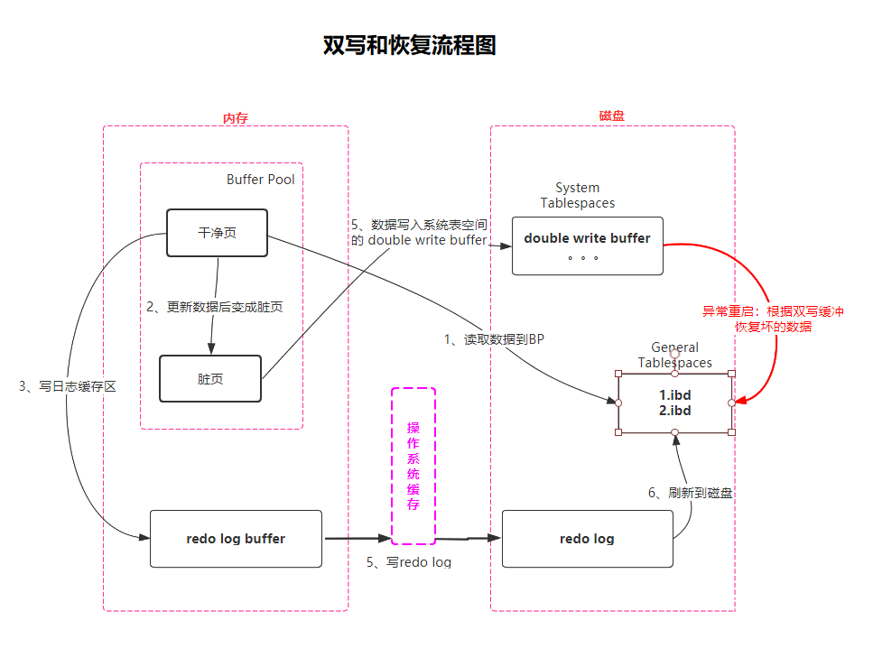

### Mysql DoubleWrite Buffer

#### 双写缓冲区（DoubleWrite Buffer）

双写缓冲区（DoubleWrite Buffer），也叫双写机制，它是一种特殊文件 flush 技术，带给 InnoDB 存储引擎的是数据页的可靠性。

它的作用是，在把页写到数据文件之前，InnoDB 先把它们写到一个叫 doublewrite buffer（双写缓冲区）的连续区域内，在写 doublewrite buffer 完成后，InnoDB 才会把页写到数据文件的适当的位置。如果在写页的过程中发生意外崩溃，InnoDB 在稍后的恢复过程中在 doublewrite buffer 中找到完好的 page 副本用于恢复。

所以，虽然叫双写缓冲区，但是这个缓冲区不仅在内存中有，更多的是属于 MySQL 的系统表空间，属于磁盘文件的一部分。

#### partial page write

由于 InnoDB 和操作系统的页大小不一致，InnoDB 页大小一般为 16k，操作系统页大小为 4k，导致 InnoDB 回写数据到操作系统中，一个页面需要写 4 次，写入过程出现问题无法保持原子性。而计算机硬件和操作系统，写的过程如果崩溃或者断电，可能导致只有一部分写回到操作系统文件系统中，整个数据只是部分成功，其实数据是损坏的。这种情况下会产生 **partial page write**（部分页写入）问题。这时页数据出现不一样的情形，从而形成一个"断裂"的页，使数据产生混乱。

#### double write 过程

双写缓冲区是 InnoDB 在表空间上的 128 个页（2 个区，extend1 和 extend2），大小是 2MB。为了解决部分页写入问题，当 MySQL 将脏数据 flush 到数据文件的时候，先使将脏数据复制到内存中的一个区域（也是 2M），之后通过这个内存区域再分 2 次，每次写入 1MB 到系统表空间，然后马上调用 `fsync` 函数（`fsync 是底层操作系统对外提供的一个 API 接口，它能保证数据必然已经落盘`），同步到磁盘上。

在这个过程中是顺序写，开销并不大，在完成 doublewrite 写入后，再将数据写入各数据文件文件，这时是离散写入。所以在正常的情况下，MySQL 写数据页时，会写两遍到磁盘上，第一遍是写到 doublewrite buffer，第二遍是写到真正的数据文件中。如果发生了极端情况（断电），InnoDB 再次启动后，发现了一个页数据已经损坏，那么此时就可以从双写缓冲区中进行数据恢复了。

双写缓冲区存在的目的就是 Innodb 为了保证 MySQL 数据的原子性。在数据库异常关闭的情况下启动时，都会做数据库恢复（redo）操作，恢复的过程中，数据库都会检查页面是不是合法（校验等等），如果发现一个页面校验结果不一致，则此时会用到双写这个功能，并对有问题的页进行数据恢复。

_如果部分页面写入doublewrite缓冲区本身，则原始页面仍将保留在磁盘上的实际位置。_

如果是写双写缓冲区本身失败，那么这些数据不会被写入磁盘，InnoDB此时会从磁盘加载原始数据，然后通过InnoDB的事务日志来计算出正确的数据，重新写入到双写缓冲区。

_当InnoDB恢复时，它将使用原始页面而不是doublewrite缓冲区中的损坏副本。但是，如果双写缓冲区成功并且对页面实际位置的写入失败，则InnoDB将在恢复期间使用双写缓冲区中的副本。_

如果doublewrite buffer写成功的话，但是写磁盘失败，InnoDB就不用通过事务日志来计算了，或者直接用buffer的数据再写一遍。

_InnoDB知道页面何时损坏，因为每个页面的末尾都有一个校验和。校验和是最后要写入的内容，因此，如果页面的内容与校验和不匹配，则页面已损坏。因此，恢复后，InnoDB只会读取doublewrite缓冲区中的每个页面并验证校验和。如果页面的校验和不正确，它将从其原始位置读取页面。_

在恢复的时候，InnoDB直接比较页面的校验和，如果不对的话，就从硬盘加载原始数据，再由事务日志开始推演正确的数据。所以InnoDB的恢复通常需要花费时间。
#### 疑问

**双写缓冲区挂了呢？**

既然 MySQL 的双写缓冲区是双写机制，第一步写到磁盘的双写缓冲区自然有可能失败。假如失败了，MySQL 会根据磁盘上 B+ 树的结构，再配合上 Redo 日志对数据进行恢复。

**既然可以通过 Redo 日志进行恢复，那么为什么还要双写缓冲区？**

Redo 日志记录的是数据页的物理操作：对 XXX 表空间中的 XXX 数据页 XXX 偏移量的地方做了 XXX 更新。

如果页都损坏了，是无法进行任何恢复操作的。所以我们需要页的一个副本，如果服务器宕机了，可以通过副本把原来的数据页还原回来。这就是 doublewrite 的作用。

**如果 Redo 日志失败了呢？**

InnoDB 是存在**事务**的，因此不存在这种情况，每个事务在提交时都会将对应的 Redo 日志刷盘，只有 Redo 日志刷盘成功了，事务才能算完成。

#### double write性能？

位于系统表空间上的 doublewrite buffer 实际上也是一个文件，写系统表空间会导致系统有更多的 fsync 操作，而硬盘的 fsync 性能因素会降低 MySQL 的整体性能。不过在存储上，doublewrite 是在一个连续的存储空间, 所以硬盘在写数据的时候是顺序写，而不是随机写，这样性能影响不大，相比不双写，降低了大概 5-10%左右。

所以，在一些情况下可以关闭 doublewrite 以获取更高的性能。比如在 slave 上可以关闭，因为即使出现了 partial page write 问题，数据还是可以从[中继日志](https://xie.infoq.cn/link?target=https%3A%2F%2Fblog.csdn.net%2Fmshxuyi%2Farticle%2Fdetails%2F100652769)中恢复。比如某些文件系统 ZFS 本身有些文件系统本身就提供了部分写失效的防范机制，也可以关闭。

