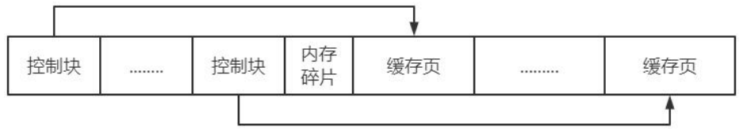
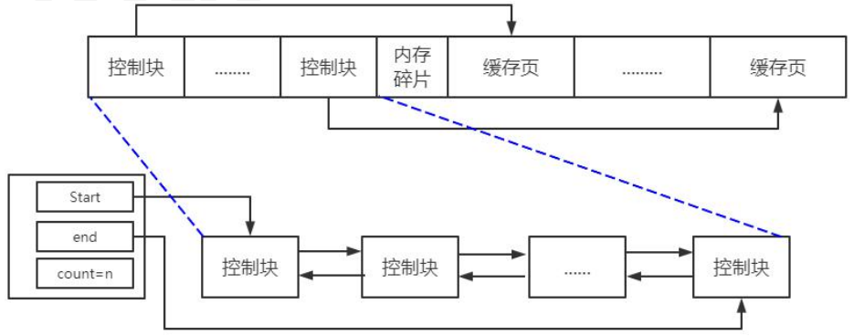
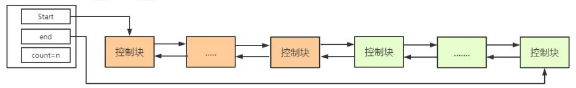

### Mysql Buffer Pool 缓冲池

对于使用 InnoDB 作为存储引擎的表来说，不管是用于存储用户数据的索引（包括聚簇索引和二级索引），还是各种系统数据，都是以页的形式存放在表空间中的，而所谓的表空间只不过是 InnoDB 对文件系统上一个或几个实际文件的抽象，也就是说我们的数据说到底还是存储在磁盘上的。

但是磁盘的速度慢，所以 InnoDB 存储引擎在处理客户端的请求时，当需要访问某个页的数据时，就会把完整的页的数据全部加载到内存中，也就是说即使我们只需要访问一个页的一条记录，那也需要先把整个页的数据加载到内存中。

将整个页加载到内存中后就可以进行读写访问了，在进行完读写访问之后并不着急把该页对应的内存空间释放掉，而是将其缓存起来，这样将来有请求再次访问该页面时，就可以省去磁盘 IO 的开销了。

注：Buffer Pool 和 MySQL 的查询缓存不是一个东西，Buffer Pool 位于存储引擎层。

#### Buffer Pool

InnoDB 为了缓存磁盘中的页，在 MySQL 服务器启动的时候就向操作系统申请了一片连续的内存，他们给这片内存起了个名，叫做 Buffer Pool。

默认情况下 Buffer Pool 只有 128M 大小（这个值其实是偏小的）。

启动服务器的时候可以通过配置 `innodb_buffer_pool_size` 参数的值来控制 Buffer Pool 大小。

##### Buffer Pool 内部组成

Buffer Pool 中默认的缓存页大小和在磁盘上默认的页大小是一样的，都是 16KB。

为了更好的管理这些在 Buffer Pool 中的缓存页，InnoDB 为每一个缓存页都创建了一些所谓的控制信息，这些控制信息包括该页所属的表空间编号、页号、 缓存页在 Buffer Pool 中的地址、链表节点信息、一些锁信息以及 LSN 信息，当然还有一些别的控制信息，我们称之为控制块。

PS：MySQL 大部分缓存的数据都在 Buffer Pool 中，缓存页就是数据，数据库查询出来的数据都会缓存到缓存页中，便于下次快速查询。控制块保存了缓存也的各种信息地址等，用来找缓存页。



##### Buffer pool 中链表结构

###### Free链表

Free 链表说简单些，就是将所有空闲的缓存页串起来，其实就是把空闲的缓存页对应的控制块的地址用一个链表来维护。这样下次有新数据进来，可以直接来 Free 链上直接找到空闲的缓存页。

Free 链还会有一个块用于存储，链表头，链表尾，以及链表上的数量。



###### Flush链表

Flush 链的结构与 Free 链完全一样。

既然我们知道 Buffer Pool 缓存的是数据库中查询出来的数据，那么必然会存在一个问题，假如数据被修改了怎么办？

因此 MySQL 把缓冲区上面这种被修改过的数据的控制块也用一个链表进行维护，以此来快速定位被修改过的数据，也被称为脏数据（未落盘的数据），因此 Flush 链又被称为脏链。

PS：**MySQL 数据提交后，并不是立刻落盘的，而是依然在缓冲区里，最后会统一落盘**。既然数据提交了自然会有 Redo 日志，假如数据库挂了，数据也是能恢复的。

**既然是脏数据为什么不知道把数据删掉？**

因为 MySQL 本身数据并不是立刻落盘的。Flush 链上的数据，MySQL 会有定时任务去定时落盘。其次虽然是叫脏数据，但是本质上这些数据就是用户提交的数据，只是没落盘而已，读取时候直接读取是没有问题的。

###### LRU链表

LRU（Least Recently Used） 链表是一种最近最少使用淘汰链表，简单逻辑就是维护一个链表，假如这个数据使用了就提到链表头。假如链表满了，需要淘汰，就从链表尾淘汰。



 MySQL 对 LRU 链表做了自己的优化改进

既然知道 MySQL 在缓冲区中缓存了查询的数据，但是查询的数据那么多，内存肯定放不下咋办？MySQL 就将数据用一个 LRU 链表进行维护，用来淘汰不常使用的数据，剩下的就是热门数据。

**MySQL 对 LRU 改进措施：**

1. 将 LRU 链表分为两部分，前面为热数据去（Young 区），后面为冷数据区（Old 区），Old 区大小占 37%。**优点**：冷热链的切分，排除了全表扫描等类似的大数据量查询，直接把热门数据淘汰出缓冲区的情况。
2. 对冷链数据移动到热链上做了时间限定。限定时间内对冷链上数据的访问不会移动到热数据区，只有超过这个时间，再次访问冷链上的数据，才会被移动到热数据区。**优点**：避免了短时间内全表扫描等大数据量频繁刷新导致，热门数据被移出热链的情况。

热链的部分，并非每次访问都会向前移动。只有在热点的后 1/4 内的数据，在访问时才会移动到热链头部，减少移动带来的资源消耗，提升性能。

可通过以下参数调整冷热区域占比占：

```mysql
mysql> show variables like 'innodb_old_blocks_pct';
+-----------------------+-------+
| Variable_name         | Value |
+-----------------------+-------+
| innodb_old_blocks_pct | 37    |
+-----------------------+-------+
1 row in set (0.00 sec)

mysql> show variables like 'innodb_old_blocks_time';
+------------------------+-------+
| Variable_name          | Value |
+------------------------+-------+
| innodb_old_blocks_time | 1000  |
+------------------------+-------+
1 row in set (0.00 sec)

```

#### Mysql刷新数据落盘途径

MySQL 后台会有个定时器，定时将数据进行统一刷新落盘，以不影响用户线程处理正常的请求。主要有两种刷新路径：

1. 从 LRU 链表的冷数据中刷新一部分页面到磁盘。
2. 后台线程会定时从 LRU 链表尾部开始扫描一些页面，扫描的页面数量可以通过系统变量 `innodb_lru_scan_depth` 来指定，如果从里边儿发现脏页，会把它们刷新到磁盘。这种刷新页面的方式被称之为 **BUF_FLUSH_LRU**。
3. 从 flush 链表中刷新一部分页面到磁盘。
4. 后台线程也会定时从 flush 链表中刷新一部分页面到磁盘，刷新的速率取决于当时系统是不是很繁忙。这种刷新页面的方式被称之为 **BUF_FLUSH_LIST**。

有时候后台线程刷新脏页落盘的进度比较慢，导致用户线程在准备加载一个磁盘页到 Buffer Pool 时没有可用的缓存页，这时就会尝试看看 LRU 链表尾部有没有可以直接释放掉的未修改页面，如果没有的话会不得不将 LRU 链表尾部的一个脏页同步刷新到磁盘（和磁盘交互是很慢的，这会降低处理用户请求的速度）。这种刷新单个页面到磁盘中的刷新方式被称之为 **BUF_FLUSH_SINGLE_PAGE**。

当然，有时候系统特别繁忙时，也可能出现用户线程批量的从 flush 链表中 刷新脏页的情况，很显然在处理用户请求过程中去刷新脏页是一种严重降低处理速度的行为，这属于一种迫不得已的情况。

#### 多个Buffer Pool实例

Buffer Pool 本质是 InnoDB 向操作系统申请的一块连续的内存空间，在多线程环境下，访问 Buffer Pool 中的各种链表都需要加锁处理，在 Buffer Pool 特别大而且多线程并发访问特别高的情况下，单一的 Buffer Pool 可能 会影响请求的处理速度。所以在 Buffer Pool 特别大的时候，我们可以把它们拆分成若干个小的 Buffer Pool，每个 Buffer Pool 都称为一个实例，它们都是独立的，独立的去申请内存空间，独立的管理各种链表，所以在多线程并发访问时并不会 相互影响，从而提高并发处理能力。

我们可以在服务器启动的时候通过设置 `innodb_buffer_pool_instances` 的值来修改 Buffer Pool 实例的个数。

那每个 Buffer Pool 实例实际占多少内存空间呢？其实使用这个公式算出来的：

```sql
innodb_buffer_pool_size/innodb_buffer_pool_instances
```

也就是总共的大小除以实例的个数，结果就是每个 Buffer Pool 实例占用的大小。不过也不是说 Buffer Pool 实例创建的越多越好，分别管理各个 Buffer Pool 也是需要性能开销的，InnoDB 规定：

> 当 innodb_buffer_pool_size（默认 128M）的值小于 1G 的时候设置多个实例是无效的，InnoDB 会默认把 innodb_buffer_pool_instances 的值修改为 1。

所以 Buffer Pool 大于或等于 1G 的 时候设置应该多个 Buffer Pool 实例。

#### 查看buffer pool 状态信息

MySQL 给我们提供了 `SHOW ENGINE INNODB STATUS\G` 语句来查看关于 InnoDB 存储引擎运行过程中的一些状态信息，其中就包括 Buffer Pool 的一些信息。

- Total memory allocated：代表 Buffer Pool 向操作系统申请的连续内存空间大小，包括全部控制块、缓存页、以及碎片的大小。
- Dictionary memory allocated：为数据字典信息分配的内存空间大小，注意这个内存空间和 Buffer Pool 没啥关系，不包括在 Total memory allocated 中。
- Buffer pool size：代表该 Buffer Pool 可以容纳多少缓存页，注意，单位是页。
- Free buffers：代表当前 Buffer Pool 还有多少空闲缓存页，也就是 free 链表中还有多少个节点。
- Database pages：代表 LRU 链表中的页的数量，包含 young 和 old 两个区域的节点数量。
- Old database pages：代表 LRU 链表 old 区域的节点数量。
- Modified db pages：代表脏页数量，也就是 flush 链表中节点的数量。
- Pending reads：正在等待从磁盘上加载到 Buffer Pool 中的页面数量。当准备从磁盘中加载某个页面时，会先为这个页面在 Buffer Pool 中分配一个缓存页以及它对应的控制块，然后把这个控制块添加到 LRU 的 old 区域的头部， 但是这个时候真正的磁盘页并没有被加载进来，Pending reads 的值会跟着加 1。
- Pending writes LRU：即将从 LRU 链表中刷新到磁盘中的页面数量。
- Pending writes flush list：即将从 flush 链表中刷新到磁盘中的页面数量。
- Pending writes single page：即将以单个页面的形式刷新到磁盘中的页面数量。
- Pages made young：代表 LRU 链表中曾经从 old 区域移动到 young 区域头部 的节点数量。
- Page made not young：在将 innodb_old_blocks_time 设置的值大于 0 时，首次访问或者后续访问某个处在 old 区域的节点时由于不符合时间间隔的限制而不能将其移动到 young 区域头部时，Page made not young 的值会加 1。
- youngs/s：代表每秒从 old 区域被移动到 young 区域头部的节点数量。
- non-youngs/s：代表每秒由于不满足时间限制而不能从 old 区域移动到 young 区域头部的节点数量。
- Pages read、created、written：代表读取，创建，写入了多少页。后边跟着读取、创建、写入的速率。
- Buffer pool hit rate：表示在过去某段时间，平均访问 1000 次页面，有多少次该页面已经被缓存到 Buffer Pool 了。
- young-making rate：表示在过去某段时间，平均访问 1000 次页面，有多少次访问使页面移动到 young 区域的头部了。
- not (young-making rate)：表示在过去某段时间，平均访问 1000 次页面，有多少次访问没有使页面移动到 young 区域的头部。
- LRU len：代表 LRU 链表中节点的数量。
- unzip_LRU：代表 unzip_LRU 链表中节点的数量。
- I/O sum：最近 50s 读取磁盘页的总数。
- I/O cur：现在正在读取的磁盘页数量。I/O unzip sum：最近 50s 解压的页面数量。
- I/O unzip cur：正在解压的页面数量。
#### 自适应 Hash 索引
自适应哈希索引是 Innodb 引擎自行研发的，用于提高 MySQL 的查询效率。

在 InnoDB 存储引擎内部自己去监控索引表，如果监控到某个索引经常用，那么就认为是热数据，然后内部自己创建一个 hash 索引，称之为自适应哈希索引（Adaptive Hash Index，AHI）。

创建以后，如果下次又查询到这个索引， 那么直接通过 hash 算法推导出记录的地址，直接一次就能查到数据，比重复去 B+tree 索引中查询三四次节点的效率高了不少。

MySQL 在哈希索引的设计上还采用了热点分散技术，这样的哈希索引在 MySQL 上默认是启动 8 个的，热点数据会分散到不同的哈希索引上，因此热数据访问时，能将请求分散到不同的哈希索引上，提高了并发访问的性能。

注：对于自适应哈希索引仅是数据库自身创建并使用的，我们并不能对其进行干预。
