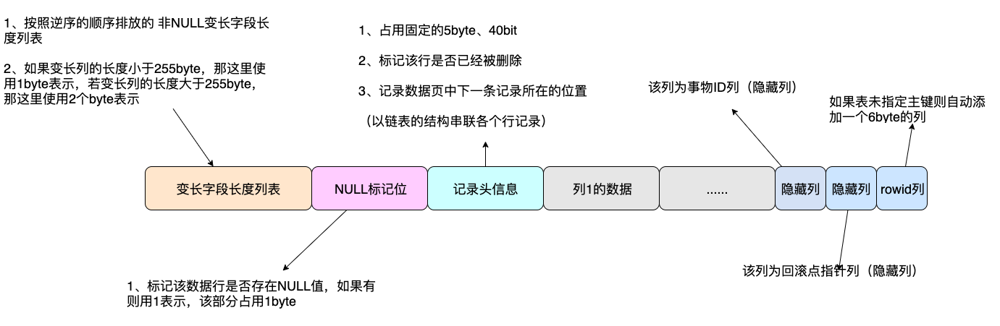

## MySQL数据库字段为什么使用 NOT NULL ？

**通常，对于默认值一般这样设置：**

1. 整形，我们一般使用0作为默认值。
2. 字符串，默认空字符串
3. 时间，可以默认`1970-01-01 08:00:01`，或者默认`0000-00-00 00:00:00`，但是连接参数要添加`zeroDateTimeBehavior=convertToNull`，建议的话还是不要用这种默认的时间格式比较好

**但是，为什么要设计为 NOT NULL 呢？**

高性能MySQL中有一段话

*尽量避免NULL*

*很多表都包含可为NULL（空值）的列，即使应用程序并不需要保存NULL也是如此，这是因为可为NULL是列的默认属性。通常情况下最好指定列为NOT NULL，除非真的需要存储NULL值。*

*如果查询中包含可为NULL的列，对MySql来说更难优化，因为可为NULL的列使得索引、索引统计和值比较都更复杂。可为NULL的列会使用更多的存储空间，在MySql里也需要特殊处理。当可为NULL的列被索引时，每个索引记录需要一个额外的字节，在MyISAM里甚至还可能导致固定大小的索引（例如只有一个整数列的索引）变成可变大小的索引。*

*通常把可为NULL的列改为NOT NULL带来的性能提升比较小，所以（调优时）没有必要首先在现有schema中查找并修改掉这种情况，除非确定这会导致问题。但是，如果计划在列上建索引，就应该尽量避免设计成可为NULL的列。*

*当然也有例外，例如值得一提的是，InnoDB使用单独的位（bit）存储NULL值，所以对于稀疏数据有很好的空间效率。但这一点不适用于MyISAM。*

书中主要说了几个问题：

1. 如果不设置NOT NULL的话，NULL是列的默认值，如果不是本身需要的话，尽量就不要使用NULL
2. 使用NULL带来更多的问题，比如索引、索引统计、值计算更加复杂，如果使用索引，就要避免列设置成NULL
3. 如果是索引列，会带来的存储空间的问题，需要额外的特殊处理，还会导致更多的存储空间占用
4. 对于稀疏数据又更好的空间效率，稀疏数据指的是**很多值为NULL，只有少数行的列有非NULL值**的情况

##### 计算、查询问题？

**对null 处理的时候，只能采用is null或is not null，而不能采用=、in、<、<>、!=、not in这些操作符号。比如：where name!=’haha’，如果存在name为null值的记录，查询结果就不会包含name为null值的记录。**

###### 聚合函数不准确

对于NULL值的列，使用聚合函数的时候会忽略NULL值。

现在我们有一张表，`name`字段默认是NULL，此时对`name`进行`count`得出的结果是1，这个是错误的。

`count(*)`是对表中的行数进行统计，`count(name)`则是对表中非NULL的列进行统计。

###### =失效

对于NULL值的列，是不能使用`=`表达式进y判断的，对`name`的查询是不成立的，必须使用`is NULL`。

###### 与其他值运算

NULL和其他任何值进行运算都是NULL，包括表达式的值也是NULL。

`user`表第二条记录`age`是NULL，所以`+1`之后还是NULL，`name`是NULL，进行`concat`运算之后结果还是NULL。

###### distinct、group by、order by

对于`distinct`和`group by`来说，所有的NULL值都会被视为相等，对于`order by`来说升序NULL会排在最前

##### 索引问题

网上很多说如果NULL那么不能使用索引的说法，这个描述其实并不准确，根据官方文档里描述，使用`is NULL`和范围查询都是可以和正常一样使用索引的。

往数据库中继续插入一些数据进行测试，当NULL列值变多之后发现索引失效了。

索引列存在NULL就会存在书中所说的导致优化器在做索引选择的时候更复杂，更加难以优化。

##### 存储空间

数据库中的一行记录在最终磁盘文件中也是以行的方式来存储的，对于InnoDB来说，有4种行存储格式：`REDUNDANT`、 `COMPACT`、 `DYNAMIC` 和 `COMPRESSED`。

MySQL默认使用`COMPACT` 行格式，所以允许NULL的时候，需要额外的空间记录NULL值（空值列表）

## MySQL行溢出机制

MySQL有多种数据行格式，Compact从MySQL5.0引入，MySQL5.1之后，行格式默认设置成 Compact 。所以本文描述的也是Compact格式。

##### Compact格式是如何做到紧凑的？

MySQL每次进行随机的IO读

默认情况下，数据页的大小为16KB。数据页中存储着数行。

那就意味着一个数据页中能存储越多的数据行，MySQL整体的进行的IO次数就越少？性能就越快？

Compact格式的实现思路是：当列的类型为VARCHAR、 VARBINARY、 BLOB、TEXT时，该列超过768byte的数据放到其他数据页中去。

MySQL这样做，有效的防止了单个varchar列或者Text列太大导致单个数据页中存放的行记录过少而让IO飙升的窘境且占内存的。

##### 什么是行溢出呢？

如果数据页默认大小为16KB，换算成byte： 16*1024 = 16384 byte

那你有没有发现，单页能存储的16384byte和单行最大能存储的 65535byte 差了好几倍呢？

**也就是说，假如你要存储的数据行很大超过了65532byte那么你是写入不进去的。假如你要存储的单行数据小于65535byte但是大于16384byte，这时你可以成功insert，但是一个数据页又存储不了你插入的数据。这时肯定会行溢出！**

其实在MySQL的设定中，发生行溢出并不是达到16384byte边缘才会发生。

对于varchar、text等类型的行。当这种列存储的长度达到几百byte时就会发生行溢。

##### 行溢出意义

MySQL使用的是B+Tree的聚簇索引，在这棵B+Tree中非叶子节点是只存索引不存数据，叶子节点中存储着真实的数据。同时叶子结点指向数据页。

MySQL想让一个数据页中能存放更多的数据行，至少也得要存放两行数据。否则就失去了B+Tree的意义。B+Tree也退化成一个低效的链表。

当你往这个数据页中写入一行数据时，即使它很大将达到了数据页的极限，但是通过行溢出机制。依然能保证你的下一条数据还能写入到这个数据页中。
